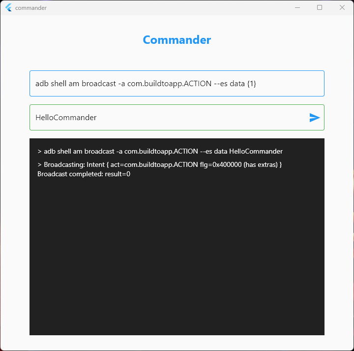

# commander

Run your commands with more ease!

# Problem Statement
Have you ever wondered you're running too many commands from your `terminal`, 
and you're just replacing an input every single time by pressing backspace or moving cursor to position.

`Don't waste your time to move the cursors => just place your inputs in commander and run!`

# Features
- Show entered command, console output and errors
- Save your last command
- Accept multiple inputs
- Automatically scroll to last console output

## How to install .msix file
Currently to be able to install the .msix file you should accept our signature by doing below steps:

- Right-click on the .msix file and select Properties
- Go to the Digital Signatures tab inside the Properties dialog
- Select the “buildtoapp.com” signer and click Details. Then click on View Certificate
- Start installing the certificate by clicking on Install Certificate
- Select Local Machine in the dialog. Click Next
- Under “Place all certificates in the following store”, click Browse
- Select the Trusted Root Certification Authorities folder. Click OK
- Click Next and then Finish
- Now, double-click on the file. You’ll see that the Install button is now enabled. Click on it to install the app